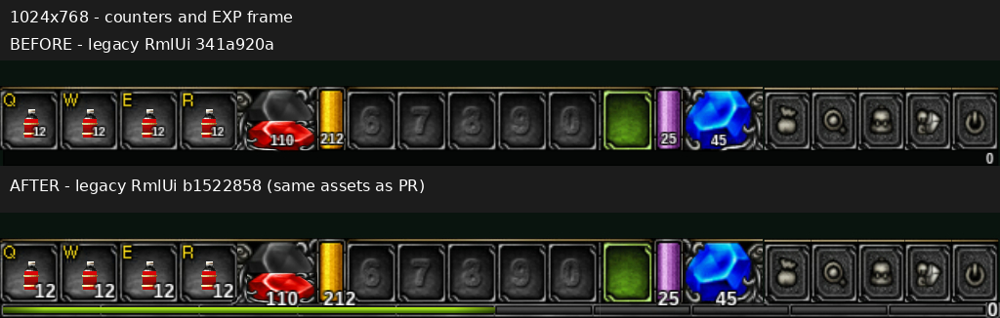
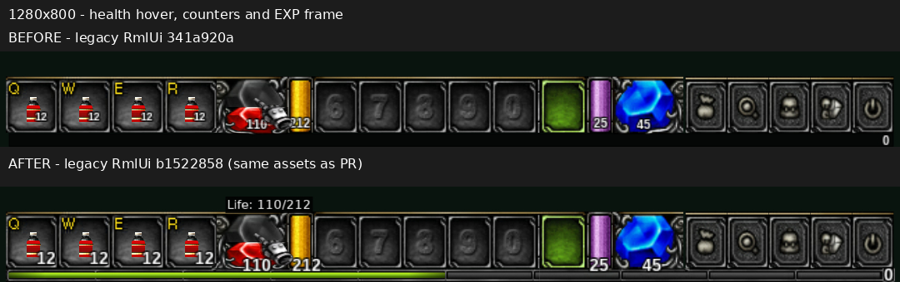

# Legacy HUD parity screenshots

Before/after evidence for `fix(ui): restore legacy HUD readout and tooltip parity`.
This image-only branch is not part of the feature contribution.

- Before: legacy RmlUi instrumented rig `341a920a`.
- After: revalidated instrumented rig `b1522858`, based on upstream `af531ce8`.
- The after rig's three legacy-theme assets are byte-identical to feature HEAD `69b6688c304f3806be66b04460554b09d9ab33f7`.
- Default UI scale; world rendering disabled for inspection.
- Crops are unscaled and unretouched. Labels were added outside the screenshot pixels.
- Cursor positions differ. EXP state differs between before and after, so these pictures demonstrate frame/readout appearance, not equal-state progress semantics.

## 1024x768 counters and EXP frame

Source captures: `1024x768_legacy_341a920a_20260922-122620.png` and `1024x768_legacy_b1522858_20260922-142919_full-unhovered.png`.
Crop rectangle: `(0, 660, 1024, 768)` in each full frame.

## 1280x800 health hover

Source captures: `1280x800_legacy_341a920a_20260922-122949.png` and `1280x800_legacy_b1522858_20260922-142924_hp-entered.png`.
Crop rectangle: `(100, 685, 1180, 800)` in each full frame.
